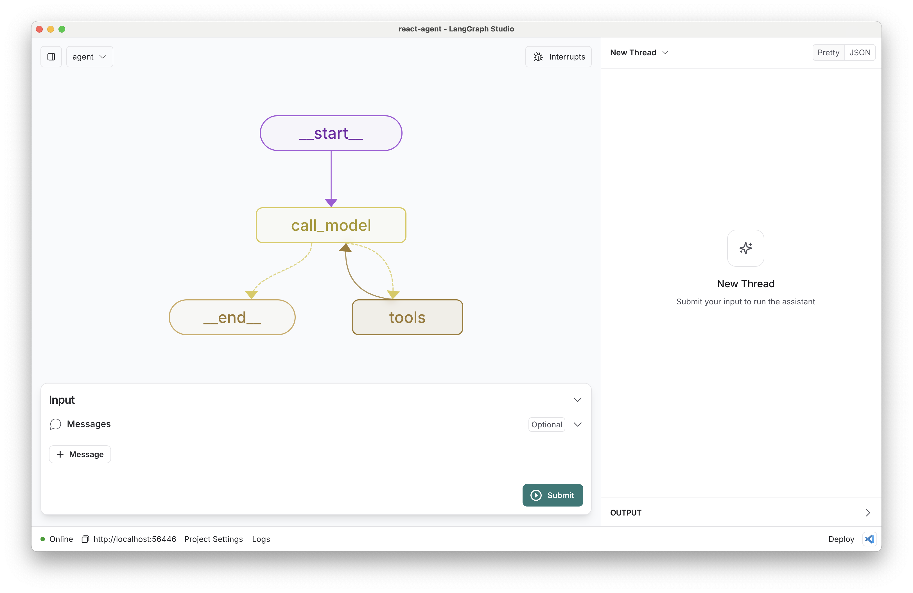
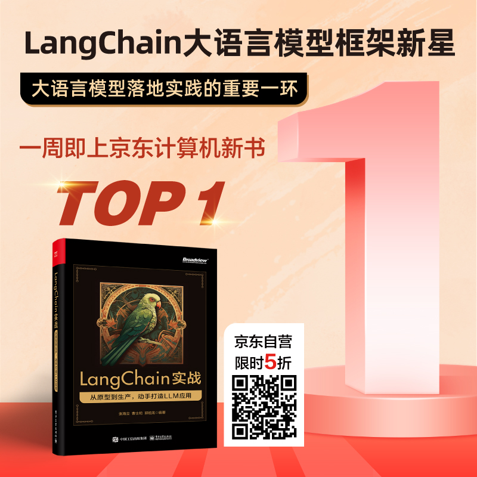

# LangGraph ReAct Agent 模板

[](https://github.com/webup/langgraph-up-react)
[](https://github.com/langchain-ai/langgraph)
[](https://github.com/webup/langgraph-up-react/actions/workflows/unit-tests.yml)
[](https://opensource.org/licenses/MIT)
[](./README.md)
[](https://deepwiki.com/webup/langgraph-up-react)
[](https://twitter.com/zhanghaili0610)

基于 [LangGraph](https://github.com/langchain-ai/langgraph) 构建的 [ReAct 智能体](https://arxiv.org/abs/2210.03629) 模板，专为本地开发者设计，与 [LangGraph Studio](https://docs.langchain.com/langgraph-platform/quick-start-studio#use-langgraph-studio) 无缝协作。ReAct 智能体是简洁的原型智能体，可以灵活扩展支持多种工具。

**🎉 最新 v0.2.0 版本**：完整的评估系统和多模型支持！查看 [发布说明](https://github.com/webup/langgraph-up-react/releases) 了解所有新功能详情。



核心逻辑定义在 `src/react_agent/graph.py` 中，展示了一个灵活的 ReAct 智能体，能够迭代地推理用户查询并执行操作。模板采用模块化架构，在 `src/common/` 中包含共享组件，集成 MCP 外部文档源，并提供完整的测试套件。

## 🌟 欢迎加入社区

**如果此项目对您有帮助，请点个 ⭐ Star，万分感谢！** 同时，您还可以访问我们的 [B 站空间](https://space.bilibili.com/31004924) 获取教程和 LangGraph 高级开发技巧。

### 📚 LangChain 实战系列图书

掌握 Agent 技术先机！从掌握 LangGraph 开始！我们的新书《LangGraph实战》现已出版，[点击查看详情](#langgraph实战书籍) ❤️

### 📱 加入飞书群

欢迎您扫描下方二维码加入我们的技术讨论群：


## v0.2.0 核心特性

### 🚀 专为国内开发者准备的模型平台
- **硅基流动 SiliconFlow**: 完整的中国大模型云平台集成，支持 Qwen、GLM、DeepSeek 等国产开源模型
- **通义千问系列模型**: 通过 `langchain-qwq` 包提供 Qwen 系列模型支持，包括 Qwen-Plus、Qwen-Turbo、QwQ-32B、QvQ-72B
- **OpenAI 兼容**: 支持 GPT-4o、GPT-4o-mini 等模型，以及任何 OpenAI API 格式的提供商

### 🔬 生产级智能体评估系统
- **双重评估框架**: 图轨迹评估 + 多轮对话仿真，全方位测试智能体性能
- **LLM-as-Judge 方法论**: 基于场景特定评判标准的专业评估系统
- **硅基流动模型评估**: 使用国产开源模型进行智能体性能基准测试，提供多种 10B 以下模型便于测试评估
- **LangSmith 集成**: 完整的评估跟踪和历史分析系统

### 🛠 Agent 工具集成生态系统
- **模型上下文协议（MCP，Model Context Protocol）**: 运行时动态外部工具加载
- **DeepWiki MCP 服务器**: 可选加载的 MCP 工具，用于 GitHub 仓库文档访问和问答功能
- **Web 搜索**: 内置传统的 LangChain 工具（Tavily），用于互联网信息的检索

### 🆕 LangGraph v0.6 新特性

> [!NOTE]
> **LangGraph v0.6 新功能**: [LangGraph Context](https://docs.langchain.com/oss/python/context#context-overview) 替代了传统的 `config['configurable']` 模式。运行时上下文现在通过 `invoke/stream` 的 `context` 参数传递，提供了更清洁、更直观的智能体配置方式。

- **上下文驱动配置**: 通过 `context` 参数传递运行时上下文，而不是 `config['configurable']`
- **简化的 API**: 为智能体传递运行时配置提供更清洁的接口
- **向后兼容**: 从旧配置模式的渐进迁移路径

### 📊 LangGraph Platform 开发支持
- **本地开发服务器**: 完整的 LangGraph Platform 开发环境
- **70+ 测试用例**: 单元、集成和端到端测试覆盖，完整测试 DeepWiki 工具加载和执行
- **ReAct 循环验证**: 确保正确的工具-模型交互

### 🤖 AI 驱动开发
- **使用 Claude Code 开发**: 本模板使用先进的 AI 开发环境构建
- **持续迭代**: 我们将持续完善和添加新模板
- **社区驱动**: 为不同场景的 LangGraph 开发提供更多选择

## 工作原理

ReAct 智能体的工作流程：

1. 接收用户**查询**作为输入
2. **推理**需要执行什么操作来回答查询
3. 使用可用工具执行选定的**操作**
4. **观察**操作结果
5. 重复步骤 2-4 直到能够提供最终答案

智能体内置 Web 搜索功能和可选的 DeepWiki MCP 文档工具，可轻松扩展以支持各种用例的自定义工具。

### 示例执行追踪

查看这些 LangSmith 追踪记录，了解智能体的实际工作原理：

- **[DeepWiki 文档查询](https://smith.langchain.com/public/d0594549-7363-46a7-b1a2-d85b55aaa2bd/r)** - 展示智能体使用 DeepWiki MCP 工具查询 GitHub 仓库文档
- **[Web 搜索查询](https://smith.langchain.com/public/6ce92fd2-c0e4-409b-9ce2-02499ae16800/r)** - 演示 Tavily Web 搜索集成和推理循环

## 快速开始

### 使用 uv 安装（推荐）

1. 安装 uv（如果尚未安装）：
```bash
curl -LsSf https://astral.sh/uv/install.sh | sh
```

2. 克隆仓库：
```bash
git clone https://github.com/webup/langgraph-up-react.git
cd langgraph-up-react
```

3. 安装依赖（包括开发依赖）：
```bash
uv sync --dev
```

4. 复制示例环境文件并填入必要的 API 密钥：
```bash
cp .env.example .env
```

### 环境配置

1. 编辑 `.env` 文件，添加您的 API 密钥：

```bash
# 必需：阿里云百炼平台模型
REGION=cn  # 或 'international' 使用国内端点（默认）

# 必需：搜索功能所需
TAVILY_API_KEY=your_tavily_api_key

# 必需：如使用通义千问模型（默认）
DASHSCOPE_API_KEY=your_dashscope_api_key

# 推荐：硅基流动大模型云平台（用于评估和多模型支持）
SILICONFLOW_API_KEY=your_siliconflow_api_key

# 可选：OpenAI 模型服务平台密钥
OPENAI_API_KEY=your_openai_key

# 可选：如使用兼容 OpenAI 模型接口的服务平台
OPENAI_API_BASE=your_openai_base

# 可选：始终启用 DeepWiki 文档工具
ENABLE_DEEPWIKI=true
```

主要搜索工具使用 [Tavily](https://tavily.com/)。在 [此处](https://app.tavily.com/sign-in) 创建 API 密钥。

## 模型配置

模板使用 `qwen:qwen-flash` 作为默认模型，定义在 [`src/common/context.py`](./src/common/context.py) 中。您可以通过三种方式配置不同的模型：

1. **运行时上下文**（编程使用推荐）
2. **环境变量**
3. **LangGraph Studio 助手配置**

### 模型配置方法

#### 1. 运行时上下文（推荐）

使用新的 LangGraph v0.6 上下文参数在运行时配置模型：

```python
from common.context import Context
from react_agent import graph

# 通过上下文配置模型
result = await graph.ainvoke(
    {"messages": [("user", "您的问题")]},
    context=Context(model="openai:gpt-4o-mini")
)
```

#### 2. 环境变量

在 `.env` 文件中设置 `MODEL` 环境变量：

```bash
MODEL=anthropic:claude-3.5-haiku
```

#### 3. LangGraph Studio 助手配置

在 LangGraph Studio 中，通过 [Assistant](https://docs.langchain.com/langgraph-platform/configuration-cloud#manage-assistants) 配置模型。创建或更新具有不同模型配置的助手，以便在不同设置之间轻松切换。

### 支持的模型格式

**模型字符串格式**：`提供商:模型名称`（遵循 LangChain [`init_chat_model`](https://python.langchain.com/api_reference/langchain/chat_models/langchain.chat_models.base.init_chat_model.html#init-chat-model) 命名约定）

```python
# OpenAI 模型
"openai:gpt-4o-mini"
"openai:gpt-4o"

# 硅基流动模型（国产开源模型云平台）
"siliconflow:Qwen/Qwen3-8B"           # Qwen 系列高效模型
"siliconflow:THUDM/GLM-4-9B-0414"     # GLM 系列对话模型
"siliconflow:THUDM/GLM-Z1-9B-0414"    # GLM 推理增强模型

# 通义千问模型（支持区域配置）
"qwen:qwen-flash"          # 默认模型
"qwen:qwen-plus"           # 平衡性能
"qwen:qwq-32b-preview"     # 推理模型
"qwen:qvq-72b-preview"     # 多模态推理

# Anthropic 模型
"anthropic:claude-4-sonnet"
"anthropic:claude-3.5-haiku"
```

### 各提供商 API 密钥设置

#### 硅基流动（推荐用于评估）
```bash
SILICONFLOW_API_KEY=your-siliconflow-api-key
```
获取 API 密钥：[硅基流动控制台](https://cloud.siliconflow.cn/me/account/ak) - 支持 Qwen、GLM、DeepSeek 等国产开源模型

#### 通义千问（默认）
```bash
DASHSCOPE_API_KEY=your-dashscope-api-key
REGION=cn  # 或 'international' 使用国际端点
```
获取 API 密钥：[DashScope 控制台](https://dashscope.console.aliyun.com/)

#### OpenAI
```bash
OPENAI_API_KEY=your-openai-api-key
```
获取 API 密钥：[OpenAI 平台](https://platform.openai.com/api-keys)

#### Anthropic
```bash
ANTHROPIC_API_KEY=your-anthropic-api-key
```
获取 API 密钥：[Anthropic 控制台](https://console.anthropic.com/)

#### OpenAI 兼容提供商
```bash
OPENAI_API_KEY=your-provider-api-key
OPENAI_API_BASE=https://your-provider-api-base-url/v1
```
支持 SiliconFlow、Together AI、Groq 和其他 OpenAI 兼容 API。

## 自定义说明

### 添加新工具
在 [`src/common/tools.py`](./src/common/tools.py) 中扩展智能体功能：

```python
async def my_custom_tool(input: str) -> str:
    """自定义工具描述。"""
    # 您的工具逻辑
    return "工具输出"
```

### 添加新的 MCP 工具
集成外部 MCP 服务器以获得更多功能：

1. **配置 MCP 服务器**，在 [`src/common/mcp.py`](./src/common/mcp.py) 中：
```python
MCP_SERVERS = {
    "deepwiki": {
        "url": "https://mcp.deepwiki.com/mcp",
        "transport": "streamable_http",
    },
    # 示例：Context7 库文档服务
    "context7": {
        "url": "https://mcp.context7.com/sse",
        "transport": "sse",
    },
}
```

2. **添加服务器函数**：
```python
async def get_context7_tools() -> List[Callable[..., Any]]:
    """获取 Context7 文档工具。"""
    return await get_mcp_tools("context7")
```

3. **在上下文中启用** - 添加上下文标志并在 `get_tools()` 函数中加载工具：
```python
# 在 src/common/tools.py 中
if context.enable_context7:
    tools.extend(await get_context7_tools())
```

> [!TIP]
> **Context7 示例**：MCP 配置中已包含注释的 Context7 服务器设置。Context7 提供最新的库文档和示例 - 只需取消注释配置并添加上下文标志即可启用。

### 修改系统提示
编辑 [`src/common/prompts.py`](./src/common/prompts.py) 中的默认系统提示。

## 开发工作流

### 启动开发服务器
```bash
make dev        # 启动 LangGraph 开发服务器（uv run langgraph dev --no-browser)
make dev_ui     # 启动带 LangGraph Studio Web UI 界面的服务器
```

### 测试
```bash
make test                    # 运行单元和集成测试（默认）
make test_unit               # 仅运行单元测试
make test_integration        # 运行集成测试  
make test_e2e               # 运行端到端测试（需要运行服务器）
make test_all               # 运行所有测试套件
```

### 代码质量
```bash
make lint       # 运行 linter（ruff + mypy）
make format     # 使用 ruff 自动格式化代码
```

### LangGraph Studio 功能
- **可视化图结构**: 查看智能体的执行流程
- **实时调试**: 逐步执行和状态检查
- **交互式测试**: 直接在 Studio 中测试智能体

## 架构

模板采用模块化架构：

- **`src/react_agent/`**: 核心智能体图和状态管理
- **`src/common/`**: 共享组件（上下文、模型、工具、提示、MCP 集成）
- **`tests/`**: 完整测试套件，包含 fixtures 和 MCP 集成覆盖
- **`langgraph.json`**: LangGraph Agent 的各项基础配置

关键组件：
- **`src/common/mcp.py`**: 外部文档源的 MCP 客户端管理
- **动态工具加载**: 基于上下文配置的运行时工具选择
- **上下文系统**: 支持环境变量的集中化配置

此架构支持多智能体和不同实现间的轻松组件重用。

## 🔬 智能体评估系统

### 为什么需要评估？

智能体评估是生产级 AI 应用的关键环节，它能够：

- **🎯 验证性能**: 确保智能体在不同场景下的推理和工具使用能力
- **🛡️ 安全检测**: 通过对抗性测试发现潜在的安全边界问题
- **📊 基准对比**: 量化不同模型和配置的性能差异
- **🔄 持续改进**: 为智能体优化提供客观的性能指标

### 双重评估框架

本模板提供业界领先的综合评估系统，采用双重评估方法论：

#### 🎯 图轨迹评估（Graph Trajectory Evaluation）
测试智能体的推理模式和工具使用决策：

```bash
# 运行所有模型和场景的图轨迹评估
make eval_graph

# 测试特定硅基流动模型
make eval_graph_qwen    # Qwen/Qwen3-8B 模型
make eval_graph_glm     # GLM-4-9B-0414 模型
```

**评估场景**：
- **简单问题**: "法国的首都是什么？" - 测试基础事实的效率回答
- **搜索必需**: "人工智能的最新新闻是什么？" - 测试工具使用和信息综合
- **多步推理**: "可再生能源的优缺点和最新发展是什么？" - 测试复杂分析任务

#### 🔄 多轮对话仿真（Multi-turn Chat Simulation）
测试对话能力和角色适应性：

```bash
# 启动开发服务器（多轮评估需要）
make dev

# 在另一个终端运行多轮评估
make eval_multiturn

# 测试特定用户角色
make eval_multiturn_polite   # 礼貌用户角色
make eval_multiturn_hacker   # 对抗性用户角色
```

**角色场景**：
- **写作助手** × 用户角色：专业邮件撰写协作
- **客服代表** × 用户角色：账户问题解决支持
- **面试官** × 用户角色：技术面试流程管理

### 硅基流动模型评估优势

使用中国领先的大模型云平台进行评估：

- **🇨🇳 国产模型**: 使用 Qwen/Qwen3-8B、GLM-4-9B-0414 等国产开源模型
- **🏅 先进评估器**: GLM-Z1-9B-0414 推理模型作为 LLM 评判器
- **🧪 丰富选择**: 提供多种 10B 以下开源模型，便于开展评估测试实验

### 评估系统详情

评估系统提供了完整的智能体性能分析框架，包含详细的测试场景、评估方法论和结果分析。

要了解具体的评估结果、测试场景和使用方法，请参阅详细的评估系统文档。

### 快速开始评估

```bash
# 设置必需的环境变量
export SILICONFLOW_API_KEY="your_siliconflow_api_key"
export TAVILY_API_KEY="your_tavily_api_key"
export LANGSMITH_API_KEY="your_langsmith_api_key"

# 运行综合评估套件
make evals

# 或分别运行各类评估
make eval_graph       # 图轨迹评估（独立运行）
make eval_multiturn   # 多轮对话评估（需要服务器）
```

# 查看更多版本信息
# 访问 GitHub Releases 页面查看所有版本发布说明：https://github.com/webup/langgraph-up-react/releases

> [!TIP]
> **硅基流动 API 密钥**: 在 [硅基流动控制台](https://cloud.siliconflow.cn/me/account/ak) 获取 API 密钥，支持 Qwen、GLM、DeepSeek 等多种国产开源模型。

### 评估系统特性

- **🎯 LLM-as-Judge 方法论**: 场景特定的自定义评判标准
- **📊 专业报告系统**: 详细的评分提取和排名系统  
- **🔍 轨迹标准化**: 兼容 JSON 序列化的轨迹处理
- **📈 LangSmith 集成**: 全面的跟踪和历史分析
- **⚙️ 集中化配置**: `config.py` 中的统一评估设置

详细评估文档请参见：[`tests/evaluations/README.md`](./tests/evaluations/README.md)

## 开发与社区

### 路线图与贡献
- 📋 **[ROADMAP.md](./ROADMAP.md)** - 当前里程碑和未来规划
- 🐛 **欢迎 Issues 和 PR** - 通过 [提交 issue](https://github.com/webup/langgraph-up-react/issues) 或提交 pull request 帮助我们改进
- 🤖 **使用 Claude Code 开发** - 本模板使用 [Claude Code](https://claude.ai/code) 积极开发维护

### 参与贡献
我们鼓励社区贡献！无论是：
- 报告 bug 或建议新功能
- 添加新工具或模型集成  
- 改进文档
- 分享您的用例和模板

查看我们的路线图，了解下一步工作计划以及如何参与贡献。

## 了解更多

- [LangGraph 文档](https://github.com/langchain-ai/langgraph) - 框架指南和示例
- [通义千问模型文档](https://help.aliyun.com/zh/dashscope/) - 模型 API 和使用指南
- [MCP 协议](https://modelcontextprotocol.io/) - 了解模型上下文协议
- [ReAct 论文](https://arxiv.org/abs/2210.03629) - 原始研究论文
- [Claude Code](https://claude.ai/code) - AI 驱动的开发环境

## LangChain 实战系列图书




## 致谢

本项目的构建离不开以下优秀的开源项目和服务平台：

### LangChain 官方项目
- **[LangGraph](https://github.com/langchain-ai/langgraph)** - 强大的智能体图构建框架
- **[LangChain](https://github.com/langchain-ai/langchain)** - 构建 LLM 应用的核心库
- **[AgentEvals](https://github.com/langchain-ai/agentevals)** - 智能体评估框架，提供 LLM-as-Judge 方法论
- **[OpenEvals](https://github.com/langchain-ai/openevals)** - 开放评估工具和方法
- **[LangSmith](https://smith.langchain.com/)** - LLM 应用跟踪和调试平台

### LangChain 社区集成
- **[langchain-siliconflow](https://pypi.org/project/langchain-siliconflow/)** - 硅基流动模型集成，提供国产开源模型支持
- **[langchain-qwq](https://pypi.org/project/langchain-qwq/)** - 阿里云百炼平台模型集成，支持通义千问系列

### MaaS 平台服务
- **硅基流动 (SiliconFlow)** - 提供国产开源模型的 MaaS 平台（中国用户 10B 以下模型永久免费）
- **阿里云百炼 (DashScope)** - 通义千问系列模型服务平台

查看所有版本更新详情：[📋 GitHub Releases](https://github.com/webup/langgraph-up-react/releases)

感谢所有贡献者和开源社区的支持！🙏
